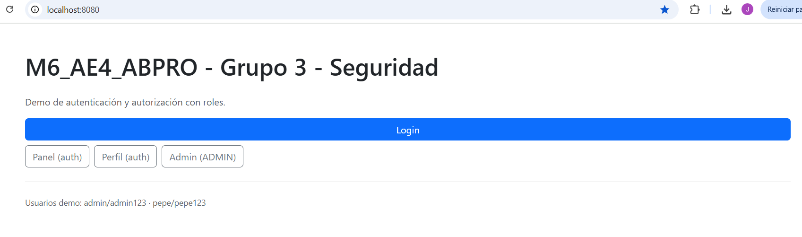
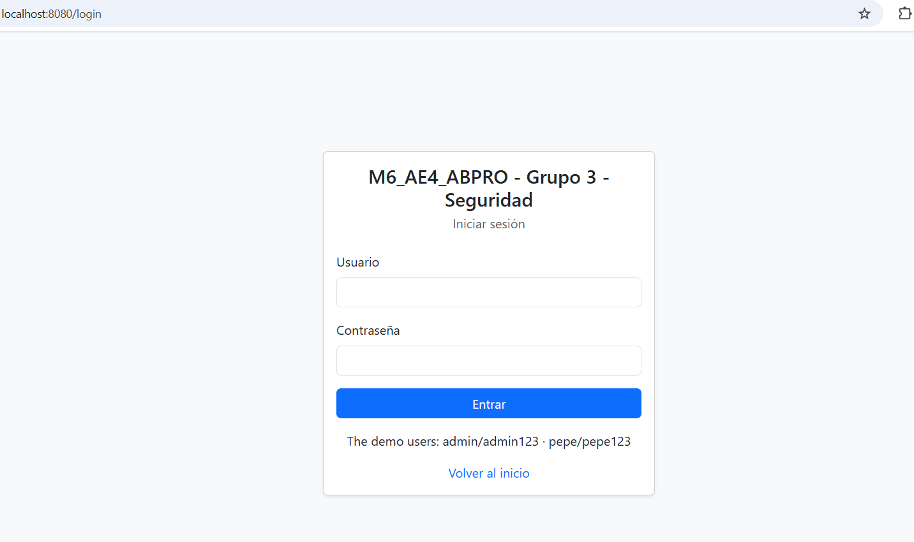
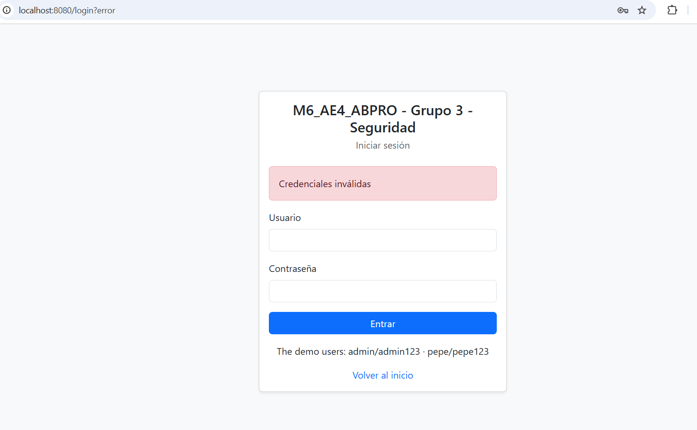
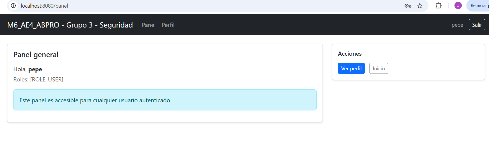
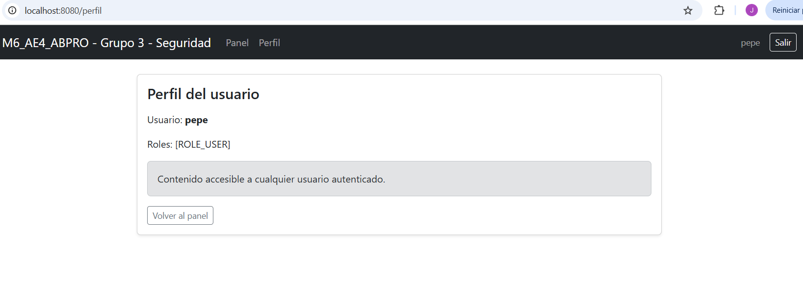
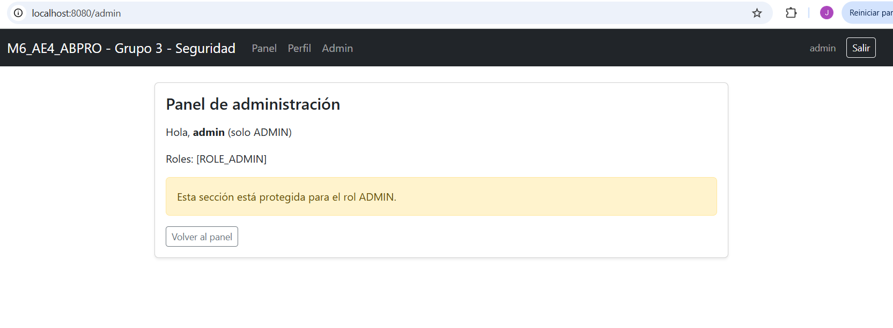
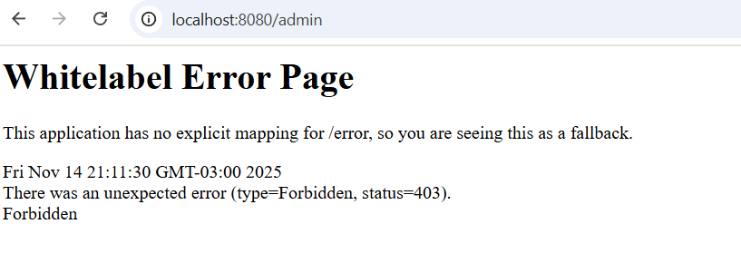
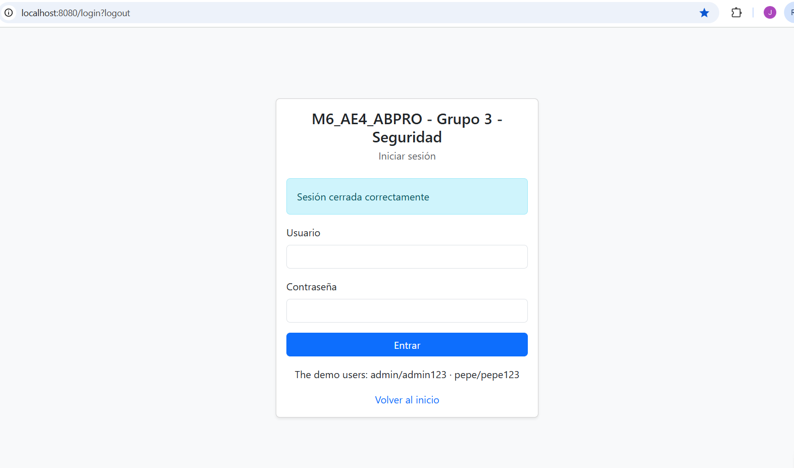

#  M6_AE4_ABPRO - Grupo 3 - Seguridad

## Integrantes

Nombres:
Alfredo San Martín,
Claudio Miguel Lira,
Daniela González,
José Correa Herrera,
Pablo Varas Salamanca.

## Profesores

Nombres:
Hector Sánchez, Cristian Jhonson

---

## Descripción del proyecto

Proyecto grupal del **Módulo 6** del Bootcamp Full Stack Java.  
El objetivo es diseñar un sistema básico de **autenticación y autorización** usando **Spring Boot, Spring Security, JPA y MySQL**, con interfaz web desarrollada en **Thymeleaf + Bootstrap 5**.

El sistema implementa:

- Autenticación con formulario de login personalizado.
- Autorización basada en roles (`USER`, `ADMIN`).
- Usuarios almacenados en base de datos (JPA + MySQL).
- Contraseñas cifradas con **BCrypt**.
- Rutas protegidas según rol.
- Interfaz moderna con **Bootstrap 5**.

---

## Requerimiento del ejercicio
Diseñar un sistema básico de autenticación y autorización que:

- Use BD como fuente de usuarios.
- Implemente roles (USER, ADMIN).
- Proteja rutas según rol.
- Utilice Spring Security + JPA + Thymeleaf.


---

## Tecnologías utilizadas

| Categoría | Herramientas |
|----------|--------------|
| Lenguaje | Java 17+ |
| Framework | Spring Boot 3.3.4 |
| Seguridad | Spring Security 6 |
| Persistencia | Spring Data JPA / Hibernate |
| Base de datos | MySQL 8 |
| Frontend | Thymeleaf + Bootstrap 5 |
| Servidor | Tomcat 10 (embebido) |
| Build Tool | Maven |
| IDE | IntelliJ IDEA / STS |

---

##  Estructura del proyecto

```
M6_AE4_ABPRO_Grupo3_Seguridad/
├─ .gitignore
├─ pom.xml
├─ README.md
│
├─ src/
│  ├─ main/
│  │  ├─ java/
│  │  │  └─ com/
│  │  │     └─ skillnest/
│  │  │        └─ m6/
│  │  │           └─ seguridad/
│  │  │              ├─ M6Ae4AbproGrupo3SeguridadApplication.java
│  │  │              ├─ config/
│  │  │              │  └─ SecurityConfig.java
│  │  │              ├─ controller/
│  │  │              │  └─ AppController.java
│  │  │              ├─ model/
│  │  │              │  └─ Usuario.java
│  │  │              ├─ repository/
│  │  │              │  └─ UsuarioRepository.java
│  │  │              └─ service/
│  │  │                 └─ JpaUserDetailsService.java
│  │  │
│  │  └─ resources/
│  │     ├─ static/
│  │     │  └─ css/
│  │     │     └─ style.css
│  │     │
│  │     ├─ templates/
│  │     │  ├─ index.html
│  │     │  ├─ login.html
│  │     │  ├─ panel.html
│  │     │  ├─ perfil.html
│  │     │  └─ admin.html
│  │     │
│  │     └─ application.properties
│  │
│  └─ test/
│     └─ java/
│        └─ com/
│           └─ skillnest/
│              └─ m6/
│                 └─ seguridad/
│                    └─ M6Ae4AbproGrupo3SeguridadApplicationTests.java
│
├─ docs/
│  ├─ 01_inicio.png
│  ├─ 02_login_correcto.png
│  ├─ 03_login_fallido.png
│  ├─ 04_panel_usuario.png
│  ├─ 05_perfil_usuario.png
│  ├─ 06_panel_admin.png
│  ├─ 07_bloqueo_acceso_admin.png
│  ├─ 08_logout.png
│  └─ M6_AE4_Grupo 3 - Spring Securiry_Presentacion.pdf
│
└─ db/
   ├─ create_database.sql
   └─ create_table.sql
   
```

---

##  Base de datos

### Script completo
```sql
CREATE DATABASE IF NOT EXISTS ae4_seguridad;
USE ae4_seguridad;

CREATE TABLE IF NOT EXISTS usuarios (
  username VARCHAR(50) PRIMARY KEY,
  password VARCHAR(100) NOT NULL,
  role     VARCHAR(20)  NOT NULL,
  enabled  BOOLEAN      NOT NULL DEFAULT TRUE
);
```

---

##  Configuración de la aplicación (`application.properties`)

```properties
spring.datasource.url=jdbc:mysql://localhost:3306/ae4_seguridad?useSSL=false&serverTimezone=America/Santiago
spring.datasource.username=root
spring.datasource.password=TU_PASSWORD

spring.jpa.hibernate.ddl-auto=update
spring.jpa.show-sql=true

spring.thymeleaf.cache=false
server.port=8080
```

---

## Usuarios iniciales

Creación automática mediante `CommandLineRunner`:

| Usuario | Contraseña | Rol |
|--------|------------|------|
| admin  | admin123   | ADMIN |
| pepe   | pepe123    | USER  |

---

##  Rutas principales del sistema

| Ruta | Acceso | Descripción |
|------|--------|-------------|
| `/` | Público | Página de bienvenida |
| `/login` | Público | Formulario de login |
| `/panel` | Autenticado | Panel general del usuario |
| `/perfil` | Autenticado | Perfil del usuario |
| `/admin` | Rol ADMIN | Panel exclusivo admin |
| `/logout` | Autenticado | Cierra sesión |

---

## Flujo de autenticación

1. Usuario ingresa credenciales en `/login`.
2. Spring Security ejecuta `JpaUserDetailsService`.
3. Se compara la contraseña ingresada con el hash BCrypt desde MySQL.
4. Si es correcta → se crea sesión.
5. Según el rol:
   - USER → puede ver `/panel` y `/perfil`
   - ADMIN → puede ver `/admin`
6. Logout destruye sesión y redirige a `/login?logout`.

---

##  Arquitectura

```
Usuario → Login → SecurityConfig → JpaUserDetailsService → JPA → MySQL
                            ↓
                       Controladores MVC
                            ↓
                     Thymeleaf + Bootstrap
```

---

##  Vistas del sistema

###  `login.html`
Formulario Bootstrap con mensajes de error o logout.

###  `panel.html`
Panel principal que muestra:
- Nombre del usuario
- Rol
- Navegación a perfil y (si corresponde) admin

###  `perfil.html`
Información del usuario autenticado.

###  `admin.html`
Solo accesible para `ADMIN`.

### ️ `index.html`
Inicio público.

---

## Capturas evidencia de funcionamiento 

Carpeta `/docs`:

| # | Archivo | Muestra                                |
|---|---------|----------------------------------------|
| 1 | 01_inicio.png | Página `/` sin autenticación           |
| 2 | 02_login_correcto.png | Login exitoso con usuario **pepe**     |
| 3 | 03_login_fallido.png | Mensaje de error `?error`              |
| 4 | 04_panel_usuario.png | Panel del usuario autenticado          |
| 5 | 05_perfil_usuario.png | Vista `/perfil`                        |
| 6 | 06_panel_admin.png | Acceso de admin a `/admin`             |
| 7 | 07_bloqueo_acceso_admin.png | Usuario USER intentando `/admin`       |
| 8 | 08_logout.png | Mensaje `Sesión cerrada correctamente` |


## Evidencias del funcionamiento

### 1 Página de inicio


### 2 Login exitoso


### 3 Login fallido


### 4 Panel del usuario autenticado


### 5 Perfil del usuario


### 6 Panel administrativo (solo ADMIN)


### 7 Acceso denegado a /admin para usuario USER


### 8 Cierre de sesión (logout)



---

## Retos y soluciones

| Desafío | Solución |
|---------|----------|
| Integración Security + JPA | Implementación de `UserDetailsService` personalizado |
| Contraseñas seguras | BCryptPasswordEncoder |
| Control de roles | `hasRole("ADMIN")` y `.authenticated()` |
| Manejo de CSRF | Tokens incluidos automáticamente |
| Interfaz clara | Bootstrap 5 + Thymeleaf |

---


